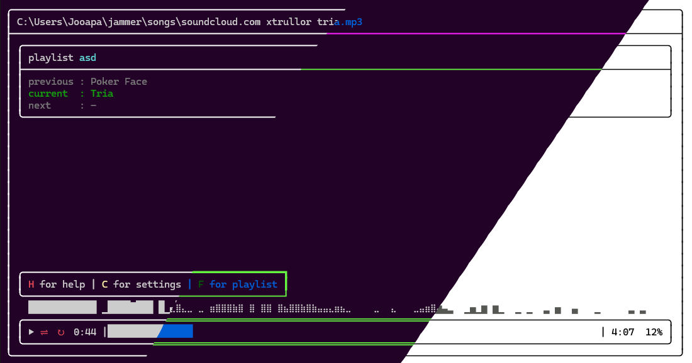

#  Jammer — light-weight TUI music player



## Introduction

Tired of opening up a browser or app to play music, and even then you can't
play local files or songs from different sites?

Jammer is a simple CLI music player that supports playing songs from your **local files**, **Youtube** and **Soundcloud**.

Compatible with **`Windows`**, *`Linux`*.

***Jammer shines its best when using it as a playlist. That's why I created it,
for the playlist feature across different platforms***

- The player doesn't stream the songs, but downloads them to local storage.
- The Jammer folder is located in the user's home directory and contains the
  downloaded songs, playlists, settings, keybinds, locales and effects modification.
- Jammer uses [Bass](https://www.un4seen.com/) for playing the songs and [ManagedBass](https://github.com/ManagedBass/ManagedBass) for being able to use it in .NET, [SoundCloudExplode](https://github.com/jerry08/SoundCloudExplode), [YoutubeExplode](https://github.com/Tyrrrz/YoutubeExplode) for downloading the songs and [Spectre.Console](https://github.com/spectreconsole/spectre.console) for the UI.

## Install/Update

### Install

Github latest [Release](https://github.com/jooapa/signal-Jammer/releases/latest)
Linux version of Jammer requires fuse2. Ubuntu 22.02 or newer install `apt
install libfuse2`.

### Update existing

```bash
jammer --update
```

## Usage

*when using **Soundcloud** or **Youtube** **links** do not forget to use **`https://`** at the start.*

```bash
jammer
jammer [song] ... [folder]
jammer https://soundcloud.com/username/track-name
jammer https://soundcloud.com/username/sets/playlist-name
jammer https://youtube.com/watch?v=video-id
jammer https://youtube.com/playlist?list=playlist-id
jammer https://raw.githubusercontent.com/jooapa/jammer/main/npc_music/616845.mp3
jammer https://raw.githubusercontent.com/jooapa/jammer/main/example/terraria.jammer
jammer "path/to/song.mp3"

jammer     --start        opens jammer folder
jammer     --update       checks for updates and installs
jammer -h, --help         show help
jammer -D                 debug mode
jammer -v, --version      show version
```

```bash
jammer -h, --help                             show this help message-
jammer -p, --play       <name>                play playlist
jammer -c, --create     <name>                create playlist
jammer -d, --delete     <name>                delete playlist
jammer -a, --add        <name> <song> ...     add song to playlist
jammer -r, --remove     <name> <song> ...     remove song from playlist
jammer -s, --show       <name> 
jammer -l, --list                             list all playlists
jammer -f, --flush                            deletes all the songs in songs folder
jammer -sp, --set-path  <path>, <default>     set path for songs folder
jammer -gp, --get-path                        get the path to the <jammer/songs> folder
jammer -hm, --home                            play all songs from the <jammer/songs> folder
jammer -so, --songs                           open <jammer/songs> folder
```

#### Example of making a playlist in cli

```bash
jammer -c new_playlist
jammer -a new_playlist https://www.youtube.com/playlist?list=PLnaJlq-zKc0WUXhwhSowwJdpe1fZumJzd
jammer -p new_playlist
```

### Supported formats

Jammer **supports** the following audio formats: ***.mp3***, ***.ogg***, ***.wav***, ***.mp2***, ***.mp1***, ***.aiff***, ***.aif***, ***.mod***, ***.mo3***, ***.s3m***, ***.xm***, ***.it***, ***.aac***, ***.adts***, ***.mp4***, ***.m4a***, ***.m4b***, ***.mid***, ***.midi***, ***.rmi***, ***.kar***

- **JAMMER** Jammer playlist
- **FOLDER** Folder/Directory (support playing all audio files within a folder)
- **YOUTUBE** Youtube video/playlist
- **SOUNDCLOUD** Soundcloud song/playlist

### MIDI support

Jammer supports playing ***.mid***, ***.midi***, ***.rmi***, ***.kar*** files. To play, you need to have a SoundFont file ***.sf2***, ***.sf3***, ***.sfz***, ***sf2pack***

Here is one sf2 file you can use [ChoriumRevA.SF2](https://www.un4seen.com/download.php?x/ChoriumRevA), *This is BASS's recommended SoundFont file.*

To change the SoundFont file, press `Shift + G` (default keybind).

`Link to a soundFont by path`: This will link the SoundFont file by path. **This will not copy the SoundFont file to the <jammer/soundfonts>.**

`Import soundfont by path`: **This will copy the SoundFont file to the `<jammer/soundfonts>`.**

Will show all the SoundFont files in the `<jammer/soundfonts>` folder.

### Themes

You can create your own theme by pressing `Shift + T` (default keybind)

Select 'Create a New Theme' and write the theme's name. Go to `<jammer/themes>`, you should see `name.json`. It will contain all the information needed for creating a theme.

### Visualizer

You can change the visualizer style in custom Themes.
To change the visualizer settings, go to `<jammer/Visualizer.ini>` and change the settings.

### Effects

- Reverb
- Echo
- Flanger
- Chorus
- Distortion
- Compressor
- Gargle
- Parametric Equalizer

These can be changed in the Effects.ini file in the jammer folder.

### Default Player Controls

| Key | Action |
|  --------  |  -------  |
| `H` | Show/hide help |
| `C` | Show/hide settings |
| `F` | Show/hide playlist view |
| `Shift + E` | Edit keybindings|
| `Shift + L` | Change language|
| `Space` | Play/pause |
| `Q` | Quit |
| `→` | Forward |
| `←` | Backward |
| `↑` | Volume up |
| `↓` | Volume down |
| `M` | Mute/unmute |
| `L` | Toggle loop |
| `S` | Toggle shuffle |
| `R` | Play in random song |
| `N` | Next song in playlist |
| `P` | Previous song in playlist |
| `Delete` | Delete current song from playlist |
| `F2` | Show playlist options |
| `Tab` | Show CMD help screen|
| `0` | Goto start of the song|
| `9` | Goto end of the song|
| `Shift + T` | Change Theme|
| `Shift + G`| Change SoundFont |

### Default Playlist Controls

| Key | Action |
| ------ | ----------- |
| `Shift + A`| Add song to playlist |
| `Shift + D`| Show songs in other playlist |
| `Shift + F`| List all playlists |
| `Shift + O`| Play other playlist |
| `Shift + S`| Save playlist |
| `Shift + Alt + S`| Save as |
| `Alt + S`| Shuffle playlist |
| `Shift + P`| Play song(s) |
| `Shift + B`| Redownload current song |
| `Shift + Y`| Search YouTube for songs |

## Language support

Translations may not be up-to-date

Currently supported languages:

- English

- Finnish

Create new translation by copying already existing .ini file from /locales and translating it.

## Star History

<a href="https://star-history.com/#jooapa/jammer&Date">
 <picture>
   <source media="(prefers-color-scheme: dark)" srcset="https://api.star-history.com/svg?repos=jooapa/jammer&type=Date&theme=dark" />
   <source media="(prefers-color-scheme: light)" srcset="https://api.star-history.com/svg?repos=jooapa/jammer&type=Date" />
   
 </picture>
</a>

## Soundcloud
### User can now change the SoundCloud client id
soundcloud every now and then changes the client id, which is not cool, so this allows change allows the user to change it :)
on default the keybind is `Alt + Shift + 1` or go change it in the `settings.json`

#### way to get the id on your own
- open up the [soundcloud.com](https://soundcloud.com)
- open the inspect element -> Network tab
- start playing some random song
- you start to see some entries in the network tab. you should see some thing like `me?client_id=wDSKS1Bp8WmdlRPkZ7NQXGs67PMXl2Nd`
# Developing

## Build / Run yourself

Download the **BASS** and **BASS_AAC** libraries from the [un4seen](http://www.un4seen.com/bass.html) website or the libaries are included in the libs folder.

On **Linux**, you need to add the libraries to the $LD_LIBRARY_PATH.

```bash
export LD_LIBRARY_PATH=/path/to/your/library:$LD_LIBRARY_PATH
```

On **Windows**, you need to add the libraries to the executable folder.

### Run

```bash
dotnet run --project Jammer.CLI -- [args]
```

### Build

#### Windows

```bash
dotnet publish -r win10-x64 -c Release /p:PublishSingleFile=true -p:DefineConstants="CLI_UI" --self-contained
```

##### Linux

Add **BASS** and **BASS_AAC** libraries to the executable folder and to $LD_LIBRARY_PATH.

```bash
dotnet publish -r linux-x64 -c Release /p:PublishSingleFile=true -p:UseForms=false -p:DefineConstants="CLI_UI" --self-contained
```

##### Linux AppImage release

AppImage requires fuse. To install fuse

```bash
sudo apt install libfuse2
```

To install appimagetool

```bash
wget https://github.com/AppImage/AppImageKit/releases/download/continuous/appimagetool-x86_64.AppImage
chmod 700 appimagetool-x86_64.AppImage
```

To create AppImage run `build-appimage.sh`

or if you want to build it from usb

```bash
sh -c "$(wget -O- https://raw.githubusercontent.com/jooapa/jammer/main/usb-appimage.sh)"
```

##### Build script for NSIS installer

```shell
.\Jammer.CLI\buildcli.bat
```

you can use `update.py` to change the version of the app.

```bash
                 |-Major
                 ||--Minor
                 |||---Patch
python update.py 101
```

### Incoming Features

- [ ] Add more audio formats

## Known Issues

Perfect app, no issues.
