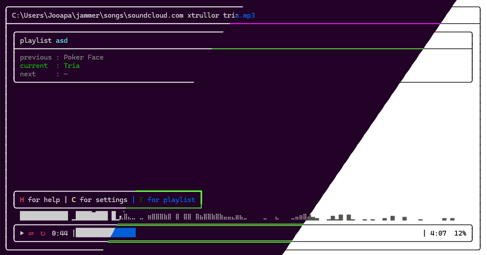

#  Jammer — light-weight CLI music player



## Introduction

Jammer is a simple CLI music player that supports playing songs from your **local files**, **Youtube** and **Soundcloud**.

Compatible with **Windows**, **Linux**, and **macOS** (Intel and Apple silicon).

- The player **doesn't** stream the songs, but downloads them to local storage.
- The Jammer folder is located in the user's home directory and contains the
  downloaded songs, playlists, settings, keybinds, locales and effects modification.
- Jammer uses [Bass](https://www.un4seen.com/bass.html) for playing the songs and [ManagedBass](https://github.com/ManagedBass/ManagedBass) for being able to use it with C#, [SoundCloudExplode](https://github.com/jerry08/SoundCloudExplode), [YoutubeExplode](https://github.com/Tyrrrz/YoutubeExplode), [yt-dlp](https://github.com/yt-dlp/yt-dlp) for downloading the songs and [Spectre.Console](https://github.com/spectreconsole/spectre.console) for the UI.

## Table of Contents

- [Recent changes](#recent-changes)
- [Install/Update](#installupdate)
- [Usage](#usage)
- [Supported formats](#supported-formats)
- [M3U and M3U8 Support](#m3u-and-m3u8-support)
- [MIDI support](#midi-support)
- [RSS](#rss)
- [Streams](#streams)
- [Soundcloud Client ID](#soundcloud-client-id)
- [Spotify Playlist Import](#spotify-playlist-import)
- [YouTube Download Backends](#youtube-download-backends)
- [Jammer Location](#jammer-location)
- [Environment Variables](#environment-variables)
- [Themes](#themes)
- [Visualizer](#visualizer)
- [Effects](#effects)
- [Language support](#language-support)
- [Developing](#developing)
- [Build / Run yourself](#build--run-yourself)
- [Known Issues](#known-issues)

## Recent changes

These are the user-facing changes from the 12 newest commits, from newest to oldest:

- [`5e44c49`](https://github.com/jooapa/jammer/commit/5e44c49) — Settings categories and values now use an arrow cursor, Up/Down navigation, and Enter to select instead of letter shortcuts.
- [`ae6e964`](https://github.com/jooapa/jammer/commit/ae6e964) — The settings view is fully redrawn after navigation, prompts, asynchronous work, cancellation, and errors.
- [`dfc6786`](https://github.com/jooapa/jammer/commit/dfc6786) — Jammer paths are centralized under the Jammer folder; path overrides remain supported, and the complete managed macOS yt-dlp bundle stays under `tools/`.
- [`f1ccf43`](https://github.com/jooapa/jammer/commit/f1ccf43) — A failed SoundCloud track download now refreshes the client ID and retries once before reporting the final error.
- [`9c78b1c`](https://github.com/jooapa/jammer/commit/9c78b1c) — Completed asynchronous settings actions trigger an immediate redraw instead of leaving an empty terminal.
- [`679054f`](https://github.com/jooapa/jammer/commit/679054f) — Terminal escape-sequence handling now recognizes navigation keys such as Page Up and Page Down consistently across platforms.
- [`3dd9803`](https://github.com/jooapa/jammer/commit/3dd9803) — Missing bundled locale files are restored to the user locale directory, and an empty locale directory no longer crashes language selection.
- [`afd9ad7`](https://github.com/jooapa/jammer/commit/afd9ad7) — Added macOS and Linux development run instructions.
- [`e69c528`](https://github.com/jooapa/jammer/commit/e69c528) — Tab now opens a quick playlist switcher with the current playlist selected initially.
- [`fc5ee5a`](https://github.com/jooapa/jammer/commit/fc5ee5a) — `scripts/build.ps1` can be executed directly on systems with PowerShell 7.
- [`3d004e6`](https://github.com/jooapa/jammer/commit/3d004e6) — Completed and synchronized the English, Finnish, and Brazilian Portuguese interface translations.
- [`4b4319f`](https://github.com/jooapa/jammer/commit/4b4319f) — Reorganized settings into categories and added cross-platform integrations for managed yt-dlp and SoundCloud client-ID management.

## Install/Update

### Install

Github latest [Release](https://github.com/jooapa/signal-Jammer/releases/latest)
Linux version of Jammer requires fuse2. Ubuntu 22.02 or newer install `apt install libfuse2 ffmpeg`

### Update existing

```bash
jammer --update
```

## Usage

*when using **Soundcloud** or **Youtube** **links** do not forget to use **`https://`** at the start.*

```bash
# examples of how to use
jammer
jammer [song] ... [folder]
jammer https://soundcloud.com/username/track-name
jammer https://soundcloud.com/username/sets/playlist-name
jammer https://youtube.com/watch?v=video-id
jammer https://youtube.com/playlist?list=playlist-id
jammer https://raw.githubusercontent.com/jooapa/jammer/main/npc_music/616845.mp3
jammer https://raw.githubusercontent.com/jooapa/jammer/main/example/terraria.jammer
jammer https://anchor.fm/s/101ec0f34/podcast/rss
jammer "path/to/song.mp3"

jammer     --start        # opens jammer folder
jammer     --update       # checks for updates and installs
jammer -h, --help         # show help
jammer -D                 # debug mode
jammer -v, --version      # show version

## these commands are for the playlists in the <jammer/playlists> folder
jammer -p, --play       <name>                # play playlist
jammer -c, --create     <name>                # create playlist
jammer -d, --delete     <name>                # delete playlist
jammer -a, --add        <name> <song> ...     # add song to playlist
jammer -r, --remove     <name> <song> ...     # remove song from playlist
jammer -s, --show       <name>                # show songs in playlist
jammer -l, --list                             # list all playlists

jammer -f, --flush                            # deletes all the songs in songs folder
jammer -gp, --get-path                        # get the path to the <jammer/songs> folder
jammer -hm, --home                            # play all songs from the <jammer/songs> folder
jammer -so, --songs                           # open <jammer/songs> folder
```

### Interactive controls

- Press `C` to open Settings, then use Up/Down to move the `>` cursor and Enter or Space to select. Page Up/Page Down and Left/Right move between pages; Escape goes back.
- Press `Tab` to open the quick playlist switcher. It starts on the current playlist and uses the same arrow-and-Enter controls.
- Default controls can be changed in `<JammerPath>/KeyData.ini`.

#### Example of making a playlist in cli

```bash
jammer -c new_playlist
jammer -a new_playlist "https://www.youtube.com/playlist?list=PLnaJlq-zKc0WUXhwhSowwJdpe1fZumJzd"
jammer -p new_playlist
```

### Supported formats

Jammer **supports** the following audio formats: ***.mp3***, ***.ogg***, ***.wav***, ***.mp2***, ***.mp1***, ***.aiff***, ***.aif***, ***.mod***, ***.mo3***, ***.s3m***, ***.xm***, ***.it***, ***.aac***, ***.adts***, ***.mp4***, ***.m4a***, ***.m4b***, ***.mid***, ***.midi***, ***.rmi***, ***.kar***

- **JAMMER** Jammer playlist
- **FOLDER** Folder/Directory (support playing all audio files within a folder)
- **YOUTUBE** Youtube video/playlist
- **SOUNDCLOUD** Soundcloud song/playlist
- **RSS** RSS feed

### MIDI support

Jammer supports playing ***.mid***, ***.midi***, ***.rmi***, ***.kar*** files. To play, you need to have a SoundFont file ***.sf2***, ***.sf3***, ***.sfz***, ***sf2pack***

Here is one sf2 file you can use [ChoriumRevA.SF2](https://www.un4seen.com/download.php?x/ChoriumRevA), *This is BASS's recommended SoundFont file.*

To change the SoundFont file, press `G` (default keybind).

`Link to a soundFont by path`: This will link the SoundFont file by path. **This will not copy the SoundFont file to the <jammer/soundfonts>.**

`Import soundfont by path`: **This will copy the SoundFont file to the `<jammer/soundfonts>`.**

Will show all the SoundFont files in the `<jammer/soundfonts>` folder.

### RSS

Jammer supports playing audio from RSS feeds. You can add an RSS feed by the url. Then you can open the rss, and it will show all the audio files in the feed.

### Streams

Streams are filtered views of your Jammer playlists that allow you to play specific subsets of songs based on tags or properties.

Currently available stream:

#### Favorites Stream (`fav` / `favorites`)

The favorites stream plays only songs that have been marked as favorites using the `IsFavorite` tag.

**Usage:**
```bash
# Play favorites from a specific playlist
jammer -p playlist:fav
jammer -p epic:favorites

# Play favorites from a playlist file
jammer example.jammer:fav
```

**How to favorite songs:**
- Press `Ctrl + F` (default keybind) while playing a song to toggle its favorite status
- Favorited songs will be marked with a ★ symbol in the player interface

This allows you to curate your favorite tracks within any playlist and easily access them later without creating separate playlist files.

### Themes

You can create your own theme by pressing `T` (default keybind)

Select 'Create a New Theme' and write the theme's name. Go to `<jammer/themes>`, you should see `name.json`. It will contain all the information needed for creating a theme.

### Visualizer

You can change the visualizer style in custom Themes.
To change the visualizer settings, you can change the `Visualizer.ini` file in the root folder.

### Effects

- Reverb
- Echo
- Flanger
- Chorus
- Distortion
- Compressor
- Gargle
- Parametric Equalizer

These can be changed in the Effects.ini file in the jammer folder.

### Jammer Location

- **Windows**: `C:\Users\username\jammer`
- **Linux**: `~/jammer`
- **macOS**: `~/jammer`

### Environment Variables

You can customize Jammer's storage locations using these environment variables:

- `JAMMER_CONFIG_PATH` - Path to the configuration directory
- `JAMMER_SONGS_PATH` - Path to the songs storage directory
- `JAMMER_PLAYLISTS_PATH` - Path to the playlists directory
- `JAMMER_YTDLP_BIN` - Path to an externally managed yt-dlp executable
- `SPOTIFY_CLIENT_ID` - Optional override for the Spotify developer application client ID

Without an override, Jammer uses centralized paths below `<JammerPath>`: `songs`,
`playlists`, `tools`, `downloads`, `cache`, `locales`, `soundfonts`, and `themes`.

**Examples:**

Windows:
```powershell
$env:JAMMER_SONGS_PATH = "D:\Music\JammerSongs"
$env:JAMMER_CONFIG_PATH = "D:\AppData\Jammer"
```

Linux/macOS:
```bash
export JAMMER_SONGS_PATH="/mnt/music/jammer_songs"
export JAMMER_CONFIG_PATH="/home/user/.config/jammer"
```

### M3U and M3U8 Support

Jammer supports m3u and m3u8 playlists. You can play them but with pretty limited functionality.

m3u files can be played just by opening them with Jammer. But cannot be opened with the `--play`, `-p` command from the `<jammer/playlists>` folder. You can `Save as` (default keybind `Alt + S`) the m3u file, Thus creating a JAMMER playlist to `<jammer/playlists>` folder.

Starting the m3u or m3u8 file with `#EXTM3U` and example of the m3u of all the features that are supported.

```m3u
#EXTM3U

#EXTINF:0,Lady Gaga - Telephone ft. Beyoncé
https://www.youtube.com/watch?v=Zwnvgz3ey78
#EXTINF:0,Epic Music 
/home/user/epic music/epic_music.mp3

/tmp/secret_klinoff.mp3
```

## Language support

The bundled translations are synchronized for the currently supported languages:

- English
- Finnish (*[antonako1](https://github.com/antonako1)*)
- Portuguese (*[Natanaelfelixx](https://github.com/Natanaelfelixx)*)

Missing bundled files are copied automatically into `<JammerPath>/locales`. Create a new
translation by copying an existing `.ini` file from `locales/` and translating it.

## Soundcloud Client ID

soundcloud every now and then changes the client id, which is not cool, so this allows change allows the user to change it :)
You can change the client id by going to the settings and changing the client id.

### how to get the id

- open up the [soundcloud.com](https://soundcloud.com/discover)
- open the inspect element -> Network tab
- start playing some random song
- you start to see some entries in the network tab. you should see some thing like `me?client_id=wDSKS1Bp8WmdlRPkZ7NQXGs67PMXl2Nd`

Or use Settings → Integrations → Fetch SoundCloud client ID. Jammer fetches the public
SoundCloud JavaScript assets over HTTP; it does not download or launch a browser.
If a SoundCloud track download fails, Jammer automatically attempts to fetch the newest
client ID and retries the download once before showing the final failure.

## Spotify Playlist Import

Jammer uses [SpotifyAPI-NET](https://johnnycrazy.github.io/SpotifyAPI-NET/) to import
track metadata from Spotify playlists that you own or collaborate on. It uses the
Authorization Code flow with PKCE, so a client secret is neither requested nor stored.

1. Create an application in the [Spotify Developer Dashboard](https://developer.spotify.com/dashboard).
2. Add this exact redirect URI to the application: `http://127.0.0.1:5543/callback/`.
3. In Jammer, open Settings → Integrations → Spotify application client ID and paste the
   application's client ID. You can alternatively set `SPOTIFY_CLIENT_ID`.
4. Select Authorize Spotify. Jammer opens Spotify in your browser and waits for the local
   callback.
5. Select Import or update Spotify playlists, then choose one playlist or Update all
   imported playlists.

The integration requests only `playlist-read-private` and `playlist-read-collaborative`.
The refreshable authorization is stored in `<JammerPath>/spotify-auth.json`; on Unix-like
systems the file is restricted to the current user. Disconnect Spotify deletes that file.

Each imported track is initially stored in its `.jammer` file like this (abbreviated):

```text
spotify-import://track/<spotify-id>?|{"Title":"...","Author":"...","ImportSource":"Spotify","SpotifyTrackId":"...","SpotifyPlaylistId":"...","SpotifyUrl":"...","Resolver":"YouTube","ResolutionStatus":"Pending"}
```

Jammer then searches the selected resolver (YouTube by default, or SoundCloud), chooses
the first result, and replaces only the placeholder URI. Spotify IDs, title/artist data,
and the Spotify attribution URL remain in the JSON so later updates can preserve resolved
matches, add new tracks, and remove tracks no longer in the Spotify playlist. Matching runs
sequentially in the background and resumes on the next launch. The integration never
requests or downloads audio from Spotify; resolved external media follows Jammer's normal
playback and cache behavior.

## YouTube Download Backends

Jammer supports two different backends for downloading YouTube content:

### YoutubeExplode (Default)
The default backend that works out of the box without any additional setup.

### yt-dlp Backend
An alternative backend that uses [yt-dlp](https://github.com/yt-dlp/yt-dlp) for downloading YouTube content.

Choose it from Settings → Integrations. Jammer validates the configured executable and,
when necessary, downloads the official release atomically into the user-writable
`<JammerPath>/tools` directory. It does not write into the application installation.
On macOS, the complete unpackaged build is kept in
`<JammerPath>/tools/yt-dlp-macos` so its executable and runtime files stay together.

Resolution order is: a valid `JAMMER_YTDLP_BIN` override, Jammer's managed binary, an
executable on `PATH`, then automatic installation. The Integrations screen also provides
install/repair and update actions. Set `JAMMER_YTDLP_BIN` only when you intentionally want
Jammer to use a separately managed executable. yt-dlp cache data is kept in
`<JammerPath>/cache/yt-dlp`.

For current YouTube extraction, Jammer automatically detects Deno, Node.js, or QuickJS
and passes the first available runtime to yt-dlp. Deno is preferred; Node.js 22 or newer
is also supported. Audio conversion automatically chooses `libopus` or `libvorbis` based
on the encoders reported by FFmpeg, avoiding a hard dependency on either one.

## Star History

<a href="https://star-history.com/#jooapa/jammer&Date">
 <picture>
   <source media="(prefers-color-scheme: dark)" srcset="https://api.star-history.com/svg?repos=jooapa/jammer&type=Date&theme=dark" />
   <source media="(prefers-color-scheme: light)" srcset="https://api.star-history.com/svg?repos=jooapa/jammer&type=Date" />
   
 </picture>
</a>

---

# Developing

## Build / Run yourself

Download the **BASS** and **BASS_AAC** libraries from the [un4seen](http://www.un4seen.com/bass.html) website or the libaries are included in the libs folder.

On **Linux**, you need to add the libraries to the $LD_LIBRARY_PATH.

```bash
export LD_LIBRARY_PATH=/path/to/your/library:$LD_LIBRARY_PATH
```

On **Windows**, you need to add the libraries to the executable folder.

## Install submodules

Jammer uses git submodules. To get the submodules, run this command in the root folder. 

```bash
git submodule update --init --recursive
```

## Scripts

See `scripts/README.md` for helper script documentation, including how to use `scripts/dotnet-install.sh` on Linux distros that do not provide a usable `dotnet` package.

### Run

```bash
dotnet run --project Jammer.CLI -- [args]
```

#### MacOS

```bash
DYLD_LIBRARY_PATH="$PWD/libs/macos/universal" dotnet run --project Jammer.CLI --
```

#### Linux

```bash
LD_LIBRARY_PATH="$PWD/libs/linux/x64" dotnet run --project Jammer.CLI --
```

### Release builds

PowerShell 7 is the single build entry point. The version comes from `VERSION`; use
`-Version` for a one-off override. Outputs are written to `artifacts/` by default.

```powershell
pwsh ./scripts/build.ps1 -Target linux-x64
pwsh ./scripts/build.ps1 -Target win-x64
pwsh ./scripts/build.ps1 -Target osx-x64
pwsh ./scripts/build.ps1 -Target osx-arm64
pwsh ./scripts/build.ps1 -Target all
```

AppImage packaging requires Linux x64. It uses `appimagetool` from `PATH` or automatically
downloads and caches the official x86_64 build under `artifacts/tools/`; the first run
therefore needs network access. The Windows installer requires Windows and `makensis`.
Both macOS targets can be cross-packaged on Linux or built on macOS. They use only
`libbass.dylib`, `libbassmidi.dylib`,
and `libbassopus.dylib` from `libs/macos/universal`; BASS AAC is not used on macOS.
Missing libraries make the script refuse to claim a runnable macOS archive. Install
`ffmpeg` separately and keep it on `PATH`.
Use `-SkipPackage` to validate cross-RID .NET publishing without packaging. macOS output
is unsigned and unnotarized; signing and notarization remain release-operator steps.

## Known Issues

Perfect app, no issues.
